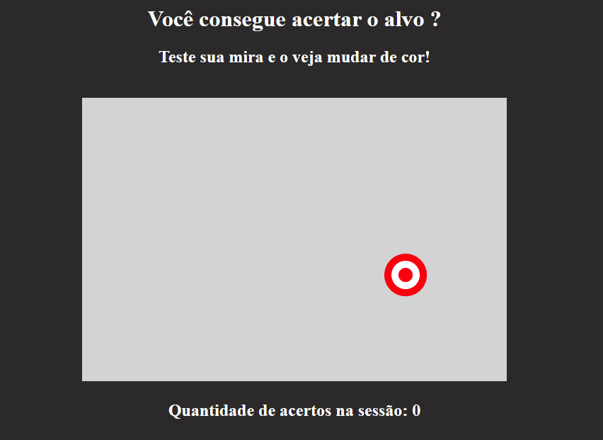

<h1 align="center"> Acerte o Alvo </h1>

Projeto feito durante o curso de Formação em Front-End pelo Programa One (Alura + Oracle).

  <a href="#-tecnologias">Tecnologias</a>&nbsp;&nbsp;&nbsp;|&nbsp;&nbsp;&nbsp;
  <a href="#-projeto">Projeto</a>&nbsp;&nbsp;&nbsp;

 

  

## 🚀 Tecnologias

Esse projeto foi desenvolvido com as seguintes tecnologias:

- HTML e CSS
- JavaScript
- Git e Github

## 💻 Projeto

O projeto foi desenvolvido com o objetivo de desafiar o usuário acertar o centro do alvo desenhado dentro do quadro, fazendo-o mudar de cor a cada acerto.

### Funcionamento

O alvo fica mudando de posição dentro do quadro definido, a cada intervalor de tempo, desafiando o usuário. Caso o mesmo o acerte no centro, o alvo muda de cor.

### Melhorias

Em comparação ao projeto original visto na Programa One, foi adicionada a seguinte melhoria:

- Contador da quantidade de acertos na mesma sessão de página.